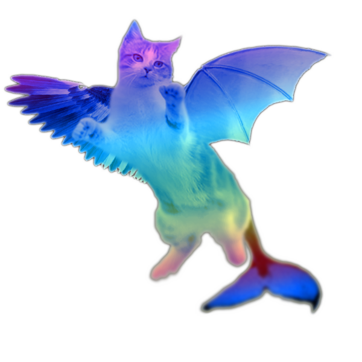

## Meu Portfólio

Marcelo de Barros, 82

Professor de Desenvolvimento de Jogos.

Programador!

# Contatos

1. Twitter:
2. Email:
3. Sei la:

- Numero 1
- Numero 2
- Numero 3

## Jogos

**Meu Jogo** : _Jogo muito legal_

### Artes

1. Adicionar apenas Link (url)
[FOFUXO](https://i.pinimg.com/originals/58/a1/7c/58a17c87559bbe1435f3cea1da626d59.jpg)

2. Adicionar Imagem da Internet (url da imagem)


3. Adicionar apenas Imagem (arquivo)


4. Adicionar Imagem que também é link (arquivo + url)
[](http://twitter.com)

5. Avançado: Adicionar Imagem que também é link e que abre em nova janela
<a href="http://twitter.com/" target="_blank"></a>

#### Alunos


### Markdown

Markdown is a lightweight and easy-to-use syntax for styling your writing. It includes conventions for

```markdown
Syntax highlighted code block

# Header 1
## Header 2
### Header 3

- Bulleted
- List

1. Numbered
2. List

**Bold** and _Italic_ and `Code` text

[Link](url) and 
```

For more details see [GitHub Flavored Markdown](https://guides.github.com/features/mastering-markdown/).

### Jekyll Themes

Your Pages site will use the layout and styles from the Jekyll theme you have selected in your [repository settings](https://github.com/ifrnjogos/ifrnjogos.github.io/settings). The name of this theme is saved in the Jekyll `_config.yml` configuration file.

### Support or Contact

Having trouble with Pages? Check out our [documentation](https://help.github.com/categories/github-pages-basics/) or [contact support](https://github.com/contact) and we’ll help you sort it out.
